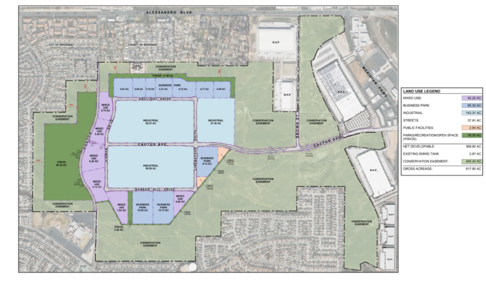
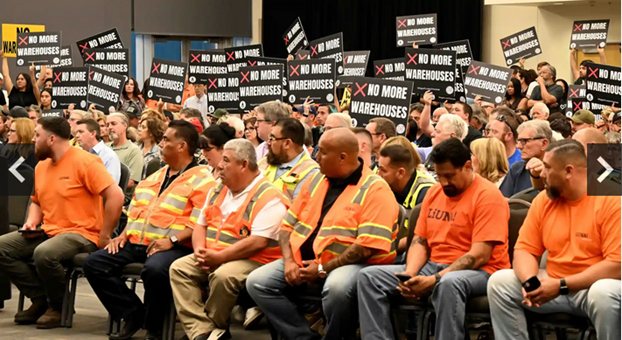
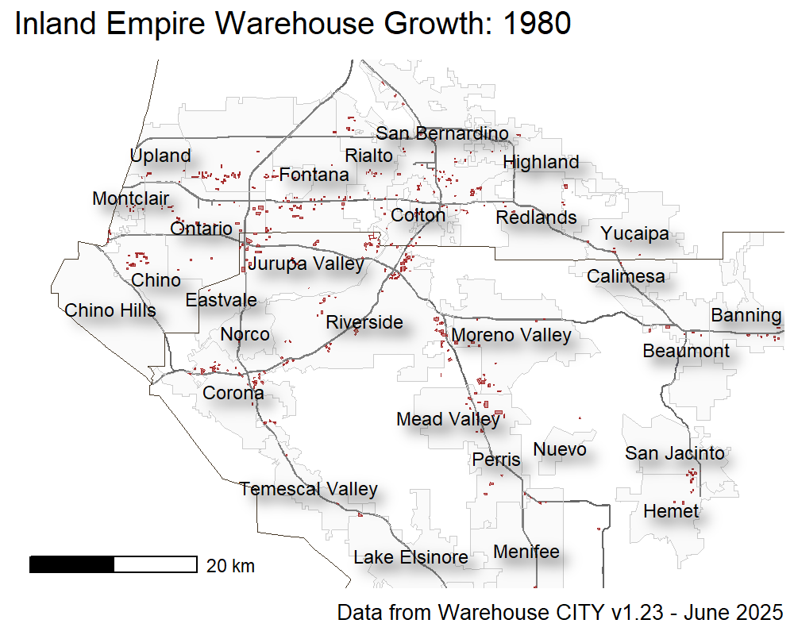
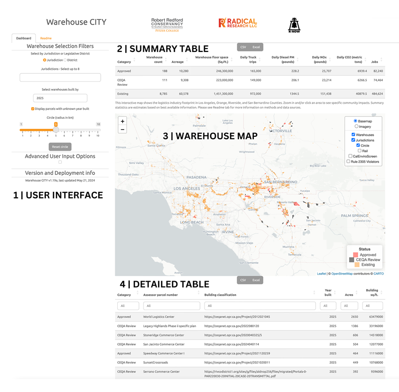
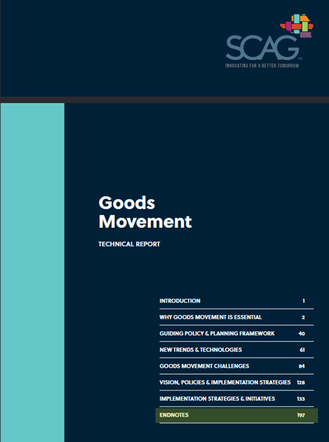
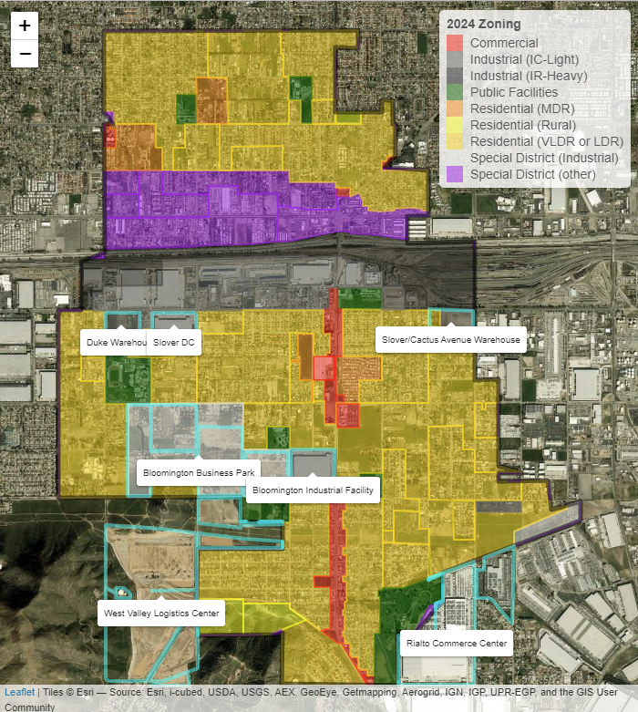
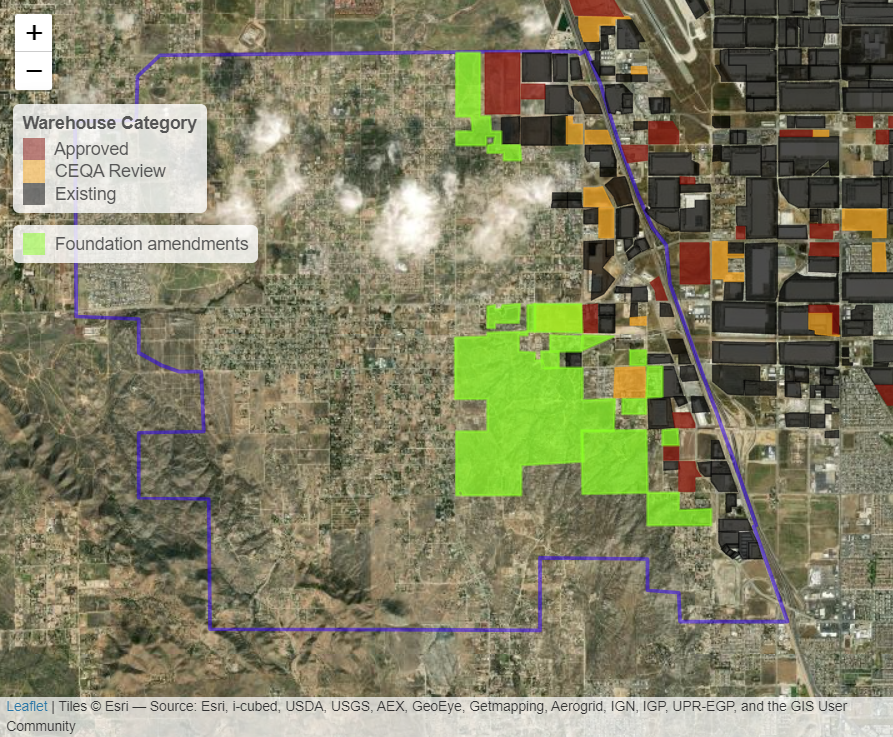
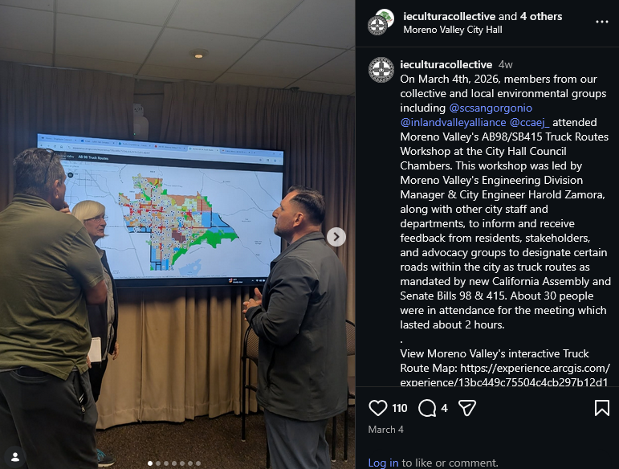
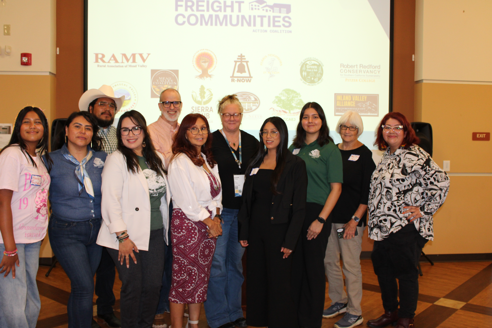

## Overview

-   Biographical context
-   Cumulative Impacts
-   Logistics Sprawl
-   Environmental Justice
-   Coalition Successes
-   Future Concerns

## Mega-Warehouse Project



## Community Activism



## Freight Coalition {.smaller}

{width="80%"}

## History

-   Environmental Consultant
    -   Radical Research LLC
    -   Sonoma Technology, Inc.
-   Education and Teaching
    -   Adjunct Professor at Pitzer College - [EA 078 - Environmental Data Visualization](https://radicalresearch.llc/EA078_Fall2024/).
    -   PhD in Chemistry from UC Berkeley
    -   BS in Chemistry from Creighton University

## A Timely Animation {.smaller}

{width="60%"}

[@phillips_op-ed_2022]

## [Warehouse CITY](https://radicalresearch.shinyapps.io/WarehouseCITY/) {.smaller}



[@phillips_warehouse_2024]

## Cumulative Impacts

-   [14 CCR § 15355(b))](https://www.law.cornell.edu/regulations/california/14-CCR-15355) - the combined environmental changes from an individual project's incremental impacts to other closely related past, present, and future projects
-   [EPA](https://www.epa.gov/system/files/documents/2022-09/Cumulative%20Impacts%20Research%20Final%20Report_FINAL-EPA%20600-R-22-014a.pdf) - the totality of exposures to combinations of chemical and non-chemical stressors and their effects on health, well-being and quality-of-life outcomes

## Logistics Sprawl

```{r}
#| label: load libraries
#| message: false
#| echo: false
#| warnings: false

library(sf)
library(tidyverse, quiet = T)
library(leaflet)
library(tigris)
library(readxl)
library(tidycensus)
library(data.table)

```

```{r}
#| label: import WH data
#| message: false
#| echo: false
#| warnings: false

WH.url <- 'https://raw.githubusercontent.com/RadicalResearchLLC/WarehouseMap/main/WarehouseCITY/geoJSON/comboFinal.geojson'
warehouses <- st_read(WH.url, quiet = T) |>  
  st_transform(crs = 4326) |> 
  mutate(decade_built = case_when(
    year_built == 1980 ~ '70s',
    year_built > 1980 & year_built <= 1990 ~ '80s',
    year_built > 1990 & year_built <= 2000 ~ '90s',
    year_built > 2000 & year_built <= 2010 ~ '00s',
    year_built > 2010 & year_built <= 2020 ~ '10s',
    year_built > 2020 & category == 'Existing' ~ '20s',
    category == 'Approved' ~ '30s',
    category == 'CEQA Review' ~'30s'
  )) |>
  mutate(decade_built2 = factor(decade_built, 
  levels = c(
    '70s', '80s', '90s', '00s', '10s', '20s', '30s'
  ))) |> 
  filter(!is.na(year_built)) |> 
  mutate(metro = case_when(
    county == 'Riverside County' ~ 'Riverside-San Bernardino-Ontario MSA',
    county == 'San Bernardino County' ~ 'Riverside-San Bernardino-Ontario MSA',
    county == 'Los Angeles County' ~ 'Los Angeles-Long Beach-Anaheim MSA',
    county == 'Orange County' ~ 'Los Angeles-Long Beach-Anaheim MSA',
    TRUE ~ NA
  ))

```

```{r}
#| label: geographic barycenter calculation
#| message: false
#| echo: false
#| warning: false

sf_use_s2(FALSE)
wh_centroid <- st_centroid(warehouses) |> 
  arrange(desc(shape_area))
coordinates <- st_coordinates(wh_centroid)


wh_centroid$lng <- coordinates[,1]
wh_centroid$lat <- coordinates[,2]  

lat <- c(rep(33.7673, 7)) 
lng <- c(rep(-118.2077, 7))
decade <- c('70s', '80s', '90s', '00s', '10s', '20s', '30s')
port <- data.frame(lng, lat, decade) |> 
  st_as_sf(coords = c('lng', 'lat'), crs = 4326) |> 
  mutate(decade = factor(decade, 
                         levels = c('70s', '80s', '90s', '00s', '10s', '20s', '30s')))

lat1 <- 33.7673 
lng1 <- -118.2077

port1 <- data.frame(lng1, lat1) |> 
  st_as_sf(coords = c('lng1', 'lat1'), crs = 4326)

distances1 <- as.numeric(st_distance(warehouses, port1))

warehouses$distance <- distances1

wh_distance_grouped <- warehouses |> 
  st_set_geometry(value = NULL) |> 
  mutate(wtd_distance = distance*shape_area) |> 
  group_by(decade_built2) |> 
  summarize(n = n(), 
            sumArea = sum(shape_area),
            sumWtdDist = sum(wtd_distance),
            meanDist = mean(distance), .groups = 'drop') |> 
  mutate(meanWtdDist = sumWtdDist/sumArea)
        
port$distance <- wh_distance_grouped$meanWtdDist
portCircle <- port |> 
  st_transform(crs = 3310) |> 
  st_buffer(dist = port$distance) |> 
  st_transform(crs = 4326)
```

```{r}
#| label: county waves
#| message: false
#| echo: false
#| warning: false

SoCalCounties <- counties(state = 'CA', year = 2023, cb = T, progress_bar = F) |> 
  filter(NAME %in% c('Los Angeles', 'Orange', 'Riverside', 'San Bernardino')) |> 
  st_transform(crs = 4326)

SoCalCounties2 <- SoCalCounties |> 
  summarize()

portArc <- portCircle |> 
  st_intersection(SoCalCounties2) |> 
  st_collection_extract(type = 'POLYGON')

```

```{r}
#| label: warehouse waves
#| caption: Warehouse CITY v1.24 distance arcs by decade
#| message: false
#| echo: false
#| warnings: false

palDec <- colorFactor(domain = portArc$decade,
            palette = 'viridis', reverse = T)
palDec2 <- colorFactor(domain = warehouses$decade_built2,
            palette = 'viridis', reverse = T)

leaflet() |> 
  setView(lat = 34.2, lng = -117.8, zoom = 9) |> 
  addProviderTiles(provider = providers$CartoDB.Positron) |> 
  addPolylines(data = portArc,
               weight = 8,
               color = ~palDec(decade)) |> 
  addLegend(data = portArc,
            title = 'Decade built',
            pal = palDec,
            values = ~decade) |> 
  addPolylines(data = SoCalCounties,
               color = 'black',
               weight = 1) |> 
  addPolygons(data = warehouses,
              color = ~palDec2(decade_built2),
              weight = 1,
              fillOpacity = 0.5
  ) |> 
  addMeasure()
```

## Warehouse Growth in the IE

```{r}
#| label: metro footprint
#| fig-cap: Warehouse CITY v1.24 metropolitan warehouse footprint by decade
#| message: false
#| echo: false
#| warnings: false

wh2 <- warehouses |> 
  st_set_geometry(value = NULL) |> 
  mutate(acres = shape_area/43560)  |> 
  arrange(county)

whCumSum <- wh2 |> 
  group_by(metro, year_built, decade_built2) |> 
  summarize(acres = sum(acres),
            count = n(), .groups = 'drop') #|>

whSum2 <- whCumSum |> 
  group_by(metro) |> 
  reframe(sumFootprint = cumsum(acres)) |> 
  select(-metro) |> 
  bind_cols(whCumSum)

 ggplot(whSum2, aes(x = metro, y = sumFootprint, fill = decade_built2)) +
  geom_col(position = position_dodge()) +
    theme_bw(base_size = 16) +
    scale_y_continuous(label = scales::comma_format(),
      breaks = c(0, 10000, 20000, 30000, 40000, 50000, 60000)) +
    labs(title = 'Cumulative SoCal warehouse footprint by decade',
         x = '', y = 'Warehouse footprint (acres)',
         fill = 'Decade', caption = ('Data from Warehouse CITY v1.24')) +
  scale_fill_viridis_d(direction = -1) 

```

## Policy

The Inland Empire was specifically targeted for warehouse development due to its '*abundant and cheap land and a traditionally undereducated population.*' @husing2004

{width="50%"}

## Ports to Warehouses

```{r}
#| label: summarize warehouse area by year
#| message: false
#| echo: false

# create a new data table 
wh_area_by_year <- warehouses |> 
  group_by(year_built) |> 
  summarize(footprint = sum(shape_area),
            count = n(), .groups = 'drop') |>
  filter(!is.na(year_built)) |> 
  arrange(year_built) |> 
  mutate(acres = round(footprint/43560, 1)) 

wh_area_summed_by_year <- wh_area_by_year |> 
  reframe(sumAcres = cumsum(acres)) |> 
  bind_cols(wh_area_by_year)

##calculate slope of trend
#lm(sumAcres~year_built, data = filter(wh_area_summed_by_year, year_built %in% c(1981:2025)))

```

```{r}
#| label: import port data
#| message: false
#| echo: false
#| warning: false

library(janitor)

LA <- read_excel(str_c('./data/', 'Port_Traffic.xlsx', sep = ''),
                 col_types = c('numeric')) |> 
  janitor::clean_names()

LB <- read_csv(str_c('./data/', 'Stats - TEU Archive Since 1995_040126.csv', sep = '')) |> 
  clean_names() |> 
  slice(1:464)

```

```{r}
#| label: process port data
#| message: false
#| echo: false
#| warning: false 

LA2 <- LA |> 
  group_by(year) |> 
  summarize(count = n(), sumLA = sum(loaded_imports, na.rm = T), .groups = 'drop')

LB2 <- LB |> 
  mutate(year = as.numeric(str_sub(date, 5, 8))) |> 
  group_by(year) |> 
  summarize(count = n(), sumLB = sum(loaded_inbound, na.rm = T), .groups = 'drop') |> 
  filter(count == 12)

PortTraffic <- full_join(LA2, LB2, by = c('year')) |> 
  filter(year > 2001) |> 
  mutate(imports = sumLA + sumLB)

```

::: {layout-ncol="2"}
```{r}
#| label: visualize port imports trend
#| message: false
#| echo: false
#| fig-height: 6
#| fig-width: 5

# display area built from 1981-2025
ggplot(PortTraffic, 
       aes(x = year, y = imports)) + 
  geom_col() +
  theme_bw(base_size = 14) +
  labs(title = 'Container imports LA/LB Ports (2002-2025)',
       x = 'Year',
       y = 'TEUs (twenty-foot equivalent units)',
       caption = 'Data from Ports of Los Angeles and Long Beach container statistics') +
  geom_smooth(method = 'lm', color = 'orange', se = F) +
  annotate(geom = 'text', x = 2010, y = 9000000, label = 'Growth in imports is 2% per year') +
  scale_y_continuous(labels = scales::comma_format())

```

```{r}
#| label: visualize warehouse trend
#| message: false
#| echo: false
#| fig-height: 6
#| fig-width: 5

# display area built from 1981-2025
ggplot(filter(wh_area_summed_by_year, year_built %in% c(2000:2025)), 
       aes(x = year_built, y = sumAcres)) + 
  geom_col() +
  theme_bw(base_size = 14) +
  labs(title = 'Warehouse area in Southern California (2000-2025)',
       x = 'Year',
       y = 'Acres',
       caption = 'Data from Warehouse City v1.24') +
  geom_smooth(method = 'lm', color = 'orange', se = F) +
  annotate(geom = 'text', x = 2010, y = 55000, label = 'Linear slope fit is 1,092 acres per year') 

```
:::

## Inland Shift

```{r}
#| label: import planned warehouse data and population data
#| message: false
#| echo: false

#Import planned Warehouse dataset from github repository
plannedWH.url <- 'https://github.com/RadicalResearchLLC/CEQA_tracker/raw/main/CEQA_WH.geojson'
plannedWarehouses <- st_read(plannedWH.url, quiet = T) |> 
  st_set_geometry(value = NULL)

#Import population data from CA DoF
county_pop <- readxl::read_excel('./data/E-1_2025.xlsx', sheet = 'E-1 CountyState2025', skip = 5)

colnames(county_pop) <- c('county', 'pop2024', 'pop2025', 'pctChange')
```

```{r}
#| label: data processing steps and statistics
#| message: false
#| echo: false

#Transform and summarize data
county_stats1 <- plannedWarehouses |> 
  group_by(county, document_type_bins) |> 
  summarize(count = n(), sum_area = sum(parcel_area), .groups = 'drop') |> 
  mutate(acres = round(sum_area/43560, 0)) |> 
  left_join(county_pop) |> 
  select(-pctChange) |> 
  mutate(WH_SF_per_capita = round(sum_area/pop2025, 1))

county_stats2 <- county_stats1 |> 
  group_by(county) |> 
  summarize(countAll = sum(count), acresAll = sum(acres),
            WH_SF_per_capitaAll = sum(WH_SF_per_capita),
            .groups = 'drop') 

county_stats <- left_join(county_stats1, county_stats2)

```

::::: columns
::: {.column width="40%"}
```{r}
#| label: summarize warehouse area by county
#| message: false
#| echo: false
#| fig-height: 6
#| fig-width: 5

#visualization of total acreage by county
  ggplot() +
    geom_col(data = county_stats, 
      aes(x = acres, y = reorder(county, acresAll), 
          fill = document_type_bins)) +
      theme_bw(base_size = 14) +
      labs(x = 'Acres', y = '', 
           title = 'CEQA warehouse acreage 2020-2026',
           fill = 'CEQA Category',
            caption = 'Warehouse data from CEQANET') +
      scale_fill_manual(values = c('darkred', 'grey40'), 
           breaks = c('Approved', 'CEQA Review')) +
      scale_x_continuous(expand = c(0,0)) +
      theme(legend.position = 'none')
```
:::

::: {.column width="\"60%"}
```{r}
#| label: summarize warehouse area per capita
#| message: false
#| echo: false
#| fig-height: 6
#| fig-width: 6

# visualization of per capita area
     ggplot() +
      geom_col(data = county_stats, 
                aes(x = WH_SF_per_capita, 
                    y = reorder(county, WH_SF_per_capitaAll), 
                    fill = document_type_bins)) +
        theme_bw(base_size=14) +
        labs(x = 'Additional Warehouse SQ FT per capita', y = '', 
           title = 'CEQA warehouse acreage 2020-2026 per capita',
           caption = 'Warehouse data from CEQANET
                      Population from CA DoF Table E-1',
           fill = 'CEQA category') +
        scale_fill_manual(values = c('darkred', 'grey40'), 
           breaks = c('Approved', 'CEQA Review')) +
        scale_x_continuous(expand = c(0,0))

```
:::
:::::

## Externalities and Sprawl {.smaller}

-   Air pollution
-   Transportation conflicts
-   Greenhouse gas emissions
-   Noise
-   Urban heat island
-   Stormwater management and groundwater recharge
-   Habitat and open-space loss
-   Sensitive receptor land-use conflicts
-   Job quality and automation

## Warehouse Employment Trend

```{r}
#| label: import jobs data
#| message: false
#| echo: false

employment_categories <- c('Wholesale Trade', 'Transportation and Warehousing')

employmentStatsIEonly <- read_csv('./data/CES_2014-2025_monthly_2026123.csv') |> 
  janitor::clean_names() |> 
  #filter(area_type == 'Metropolitan Area') |> 
  filter(seasonally_adjusted_y_n == 'N' ) |>
  filter(industry_title %in% employment_categories) |>
  filter(area_name %in% c('Riverside-San Bernardino-Ontario MSA')) |> 
  mutate(MSA = 'IE', date2 = lubridate::mdy(date)) 

```

```{r}
#| label: job processing steps and statistics
#| message: false
#| echo: false

IEData_2019_fwd <- employmentStatsIEonly |> 
  filter(industry_title != 'Total Nonfarm') |> 
  filter(year > 2019) |> 
  select(date2, current_employment, industry_title)

latestMonth2 <- IEData_2019_fwd |> 
  filter(industry_title != 'Manufacturing') |> 
  group_by(date2) |> 
  summarize(jobs = sum(current_employment)) |> 
  arrange(desc(date2))

latestJobs2 <- pull(latestMonth2[1,2])
currentYMD2 <- pull(latestMonth2[1,1])

```

```{r}
#| label: summarize jobs trends by county
#| message: false
#| echo: false

IEData_2019_fwd |> 
  filter(industry_title != 'Manufacturing') |> 
  filter(date2 > mdy('12-31-2020')) |> 
  ggplot(aes(x = date2, y = current_employment, fill = industry_title)) +
  geom_col() +
  theme_bw(base_size = 16) +
  scale_y_continuous(labels = scales::comma_format()) +
  labs(x = '', y = 'Employment Numbers', fill = 'Industry category',
       title = 'Inland Empire Logistics Job Trends 2021-2025',
       caption = 'Data from CA EDD Labor Market Info - 
       www.labormarketinfo.edd.ca.gov')+
  geom_hline(yintercept = latestJobs2, color = 'darkred', linetype = 'dashed') +
  scale_x_date(date_label = '%b-%y', 
               breaks = seq(as.Date('2021-01-01'),
                            as.Date(currentYMD2),
                            by = '6 months'),
               expand = c(0,0)) +
  scale_fill_manual(values = c('grey60', 'grey30')) +
  annotate('text', x = lubridate::mdy('01/01/2025'), y = latestJobs2 + 15000, 
           color = 'darkred', label = paste('Current employment - ', latestJobs2)) +
  theme(legend.position = 'bottom',
        text = element_text(size = 12))

```

## IE Warehouse Numbers {.smaller}

-   4,000+ warehouses
-   40,000 acres or 62 square miles covered
-   600,000+ daily truck trips emitting 26,000 tons of CO2 and 50 tons of NOx
-   12% of vehicles on IE freeways are trucks (2x LA/OC)
-   10,000 acres of approved warehouses and 10,000 acres under environmental review
-   1-in-6 IE jobs are warehouse related

## Highest Warehouse Area Municipalities

```{r}
#| label: import census population data
#| message: false
#| echo: false

'%ni%' <- Negate('%in%') ## not in operator
#Import planned Warehouse dataset from github repository

CA_place_2024 <- get_acs(state = 'CA', geography = 'place', vintage = 2024,
                    variables = 'B01003_001') |> 
  select(GEOID, NAME, estimate) |> 
  rename(pop2024 = estimate) |> 
  mutate(Name2 = str_remove(NAME, ' CDP, California')) |> 
  mutate(Name3 = str_remove(Name2, ' city, California')) |> 
  mutate(place = str_remove(Name3, ' town, California')) |> 
  select(GEOID, place, pop2024) |> 
  filter(GEOID %ni% c('0608968', '0621796'))

county_pop <- get_acs(state = 'CA', geography = 'county', vintage = 2024,
                    variables = 'B01003_001') |>
  mutate(county = str_remove(NAME, ', California')) |> 
  filter(NAME %in% c('Riverside County, California', 'San Bernardino County, California',
                     'Los Angeles County, California', 'Orange County, California')) |> rename(pop2024 = estimate) |> 
  select(county, pop2024)

```

```{r}
#| label: population processing and stats
#| message: false
#| echo: false

annexationWH <- warehouses |> 
  filter(category != 'Existing') |> 
  filter(place_name == 'unincorporated') |>
  st_set_geometry(value = NULL) |> 
  mutate(place_name = case_when(
    apn == 'Westside Annexation and North Lancaster Industrial Specific Plan' ~ 'Lancaster',
    apn == '2022 Legacy Highlands Specific Plan Project' ~ 'Beaumont',
    apn == 'Sunset Crossroads Project' ~ 'Banning',
    apn == 'Beaumont Heights Business Centre Project' ~ 'Beaumont',
    apn == 'Beaumont Pointe Specific Plan' ~ 'Beaumont',
    apn == 'CV Commerce Center' ~ 'Cathedral City',
    apn == 'Lime Avenue Annexation & Quarry Commerce Center' ~ 'Fontana',
    apn == 'Philadelphia Street Industrial Development Site and East End Annexation Project' ~ 'Chino',
    apn == 'Lilac Logistics Center' ~'Beaumont',
    TRUE ~ 'unincorporated'
  ))

warehouse_citystats <- warehouses |> 
  st_set_geometry(value = NULL) |> 
  filter(!is.na(category)) |> 
  bind_rows(annexationWH) |> 
  group_by(county, place_name, category) |> 
  summarize(count = n(),
            area = sum(shape_area), .groups = 'drop') |> 
  arrange(desc(area)) |> 
  mutate(county = str_remove(county, ' County')) |> 
  filter(county %in% c('Riverside', 'San Bernardino')) |> 
  filter(place_name != 'unincorporated') |> 
  left_join(CA_place_2024, by = c('place_name'= 'place')) |> 
  mutate(WHperCapita = round(area/pop2024, 0)) |> 
  select(-GEOID) |> 
  arrange(desc(WHperCapita))

warehouse_county_stats <- warehouses |> 
  st_set_geometry(value = NULL) |> 
  group_by(county, category) |> 
  summarize(countCounty = n(),
            areaCounty = sum(shape_area), .groups = 'drop') |> 
  left_join(county_pop) |> 
  mutate(county = str_remove(county, ' County')) |> 
  mutate(CountyperCapita = round(areaCounty/pop2024, 0)) |>
  select(-pop2024)

combo_statsPerCapita <- warehouse_citystats |> 
  left_join(warehouse_county_stats, by = c('county', 'category'))

place_stats <- combo_statsPerCapita |> 
  group_by(county, place_name, pop2024) |> 
  summarize(totalPerCap = sum(WHperCapita),
            areaSQFT = sum(area),
            .groups = 'drop') |> 
  arrange(desc(totalPerCap)) 
  
top25_perCapita <- place_stats |> 
  slice(1:25) |> 
  pull(place_name)

top25_existing <- warehouse_citystats |> 
  filter(category == 'Existing') |> 
  arrange(desc(WHperCapita)) |> 
  mutate(existingPerCap = WHperCapita) |> 
  select(place_name, existingPerCap)

growing <- warehouse_citystats |> 
  filter(category != 'Existing') |> 
  group_by(place_name) |> 
  summarize(newPerCap = sum(WHperCapita), .groups = 'drop') |>
  select(place_name, newPerCap)

filtered_stats <- combo_statsPerCapita |> 
  left_join(top25_existing) |> 
  left_join(place_stats) |> 
  left_join(growing) 

```

```{r}
#| label: summarize city warehouse area per capita
#| message: false
#| echo: false


filtered_stats |> 
  filter(pop2024 > 10000) |> 
  filter(existingPerCap > 400) |> 
  ggplot( 
       aes(y = reorder(place_name,existingPerCap), x = WHperCapita, fill = category)) +
  geom_col() +
  theme_bw(base_size = 16) +
  scale_x_continuous(labels = scales::comma_format(),
                     expand = c(0,0),
                     breaks = c(0,500,1000,1500, 2000, 2500, 3000,3500, 4000, 4500)) +
  scale_fill_manual(values = c('red', 'orange',  'black'), name = NULL) +
  labs(x = 'Warehouse (SQ FT) per resident',y = '',
       title = 'Existing Warehouse area per resident, 10,000 residents',
       caption = 
       'Population data from 2024 US Census;
       Warehouse data from WarehouseCITY v1.24') +
  geom_vline(color = 'white', xintercept = 151, linetype = 'twodash')

```

## Municipalities with Highest Warehouse Growth

```{r}
#| label: summarize warehouse area proposed or under review
#| message: false
#| echo: false

filtered_stats |> 
  filter(pop2024 > 10000) |> 
  filter(newPerCap > 300) |>  
  ggplot(aes(y = reorder(place_name, newPerCap), x = WHperCapita, fill = category)) +
  geom_col() +
  theme_bw(base_size = 16) +
  scale_x_continuous(labels = scales::comma_format()) +
  scale_fill_manual(values = c('red', 'orange', 'black'), name = NULL) +
  labs(x = 'Warehouse (SQ FT) per resident',y = '',
       title = 'Warehouse area per resident; new projects; 10,000+ residents',
       caption = 'Population data from 2024 US Census;
       Warehouse data from WarehouseCITY v1.24')

```

## Population and Housing

```{r}
#| label: SoCal Population
#| message: false
#| echo: false

counties <- get_estimates(geography = c('county'),
                          state = 'CA',
                          vintage = 2025,
                          time_series = T,
                          product = 'population') |> 
  filter(variable == 'POPESTIMATE') |> 
  select(NAME, year, value, GEOID)

counties2010 <- get_estimates(
  geography = c('county'),
  state = 'CA',
  vintage = 2019,
  time_series = T,
  product = 'population') |> 
  mutate(year = 2008+DATE) |> 
  filter(variable == 'POP') |>
 #filter(year >= 2010) |> 
  filter(year < 2020) |> 
  select(NAME, year, value, GEOID)


pop_timeSeries <- bind_rows(counties, counties2010) |> 
  mutate(NAME = str_remove(NAME, ' County, California')) |> 
  filter(NAME %in% c('Los Angeles', 'Orange', 'Riverside', 'San Bernardino')) |> 
  group_by(year) |> 
  summarize(population = sum(value, na.rm = T))


```

```{r}
#| label: population trend
#| message: false
#| echo: false
#| caption: Population trends by county from US Census estimates

ggplot(pop_timeSeries, aes(x = year, y = population)) +
  geom_line() +
  theme_bw(base_size = 16) + 
  scale_y_continuous(labels = scales::comma_format()) +      scale_x_continuous(breaks = c(2008, 2010, 2012, 2014, 2016, 2018, 2020, 2022, 2024)) +
  labs(x = '', y = 'Population', caption = 'Data from US Census Population Estimates',
       title = 'Population Trend in Southern California',
       fill = 'County') +
  geom_hline(color = 'red', linetype ='dashed', yintercept = 17613000) +
  scale_fill_viridis_d()

```

## Bloomington



## Mead Valley



## Coalition Successes

## R-NOW {.smaller}

-   March JPA unanimously voted [to reject the controversial West Campus Upper Plateau Project](https://riversiderecord.org/march-jpa-commission-unanimously-rejects-controversial-warehouse-project/)
-   City of Riverside [approves stricter regulations on warehouses](https://riversiderecord.org/riverside-approves-updates-to-zoning-code-adds-stricter-regulations-on-warehouses/)
-   Won \$5,000 grant from Rose Foundation [California Wildlands Grassroots Fund](https://rosefdn.org/environmental-grants/california-wildlands-grassroots-fund/) {width="50%"}

## Sierra Club {.smaller}

{width="80%"}

-   [Revisions to Truck Route Map](https://experience.arcgis.com/experience/13bc449c75504c4cb297b12d15c8b987)
-   Legal victory over city of [Moreno Valley indadequate Climate Action Plan](https://www.sierraclub.org/press-releases/2024/05/sierra-club-wins-legal-victory-clean-air-moreno-valley)

## Freight Communities Action Coalition {.smaller}

-   \$250,000 Educational Grant from [California Air Resources Board](https://ww2.arb.ca.gov/capp/cag/Cycle-5-Awards)
-   [AB 98 Truck Route Summit](https://iecn.com/inland-empire-cities-fail-warehouse-regulation-deadline/)

{width="80%"}

## State and Regional Coalition Successes {.smaller}

-   State
    -   [Assembly Bill 98](https://calmatters.org/economy/2024/09/inland-empire-warehouse-bill/) and follow-up bills SB 415 and AB 735
-   Regional
    - South Coast Air Quality Management District [Warehouse Indirect Source Rule - Rule 2305](https://www.aqmd.gov/home/rules-compliance/compliance/waire-program)
    -   [Region in Crisis Report](https://www.ccaej.org/regionincrisis) - @regioni2023

## Local Coalition Successes

-   [Airport Gateway Specific Plan](https://iecn.com/san-bernardino-agency-cancels-airport-project/)
-   [Bloomington Business Park](https://calmatters.org/environment/2024/10/newsom-and-judge-throw-wet-blanket-on-inland-empire-warehouse-boom/)
-   [Newland Simpson Project](https://www.pressenterprise.com/2026/03/11/hemet-warehouse-proposal-rejected-for-the-third-time/)
-   [Warehouse Moratorium](https://riversiderecord.org/perris-city-council-extends-warehouse-moratorium-to-december/)
-   [Perris Updated Good Neighbor Guidelines](https://www.facebook.com/CityOfPerris/posts/january-13-2026-perris-city-council-meeting-highlightsat-its-regular-meeting-the/1181400970813900/)
-   [Freeway Corridor Specific Plan](https://www.communityforwardredlands.com/yucaipa-rescinds-warehouse-linked-corridor-plan/)

## Future Concerns

## Geopolitical Instability


## Automation


## Climate Change

```{r}
#| label: import CO2 data
#| echo: false
#| message: false
#| warning: false


co2 <- read_table('https://www.gml.noaa.gov/webdata/ccgg/trends/co2/co2_mm_mlo.txt',
                  skip = 57 ) #%>%

fieldNames <- c('year', 'month', 'decDate', 'meanCO2', 'trendedCO2', 'days', 'stdev', 'unc')
colnames(co2) <- fieldNames

```

```{r}
#| label: Carbon dioxide trend at Mauna Loa
#| echo: false
#| message: false
#| warning: false

co2 |>  
  ggplot(aes(x = decDate, y = meanCO2)) +
  geom_line() +
  theme_bw() +
  labs(x = 'Year', y = 'CO2 concentration (ppm)',
       Title = 'Atmospheric CO2 concentration at Mauna Loa',
       caption = 'Data from NOAA GML - https://gml.noaa.gov/ccgg/trends/') +
  scale_x_continuous(breaks = c(1960, 1970, 1980, 1990, 2000, 2010, 2020)) +
  scale_y_continuous(breaks = c(310, 330, 350, 370, 390, 410, 430)) +
  theme_bw() +
  geom_smooth(se = F)
```

## Acknowledgements {.smaller}

- Professor Susan A. Phillips
- CCAEJ - Ana Gonzelez, Tatiana Flores, Joaquin Castillejos
- Sierra Club - Mary Ann Ruiz, George Hague, Karla Cervantes
- R-NOW - Jennifer Larratt-Smith, Jerry Shearer, Andrew Silva
- Franco Pacheco
- Graham Brady 
- PCEJ, Perris Neighbors in Action, Save Temescal Valley, Focus Nuevo, Green Coalition of San Jacinto, Rural Association of Mead Valley, Inland Valley Alliance for Environmental Justice
- California Air Resources Board and California Climate Investments
- Rose Foundation

## References
